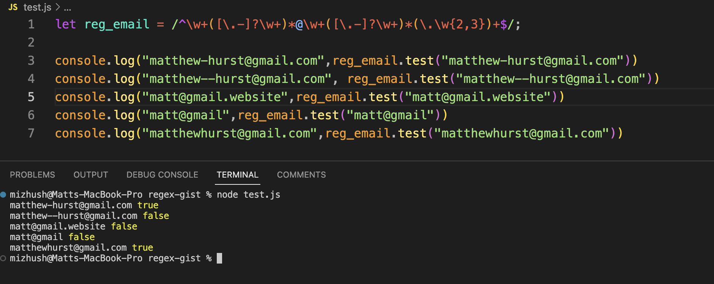

# Email Verification Via Regular Expressions (Regex)

## Introduction

Regular expressions, often abbreviated as Regex, are powerful tools used in numerous programming languages to identify specific text patterns within strings. In this guide, we will explore a fundamental application of Regex for validating email addresses using JavaScript.

The tutorial covers two essential aspects of Regex:

1. Understanding the structure of the regular expression object and its syntax.
2. A concise introduction to the methods associated with the regular expression object.

Throughout this tutorial, we will work with a regular expression designed to validate email formats. The objective of this Regex application is to identify three substrings separated by a single "@" symbol and another "." character within a submitted email. The text preceding "@" is referred to as the email prefix, while the text to the right of "@" constitutes the email domain.

## Table of Contents

- [Regex Components](#components)
- [Anchors](#anchors)
- [Quantifiers](#quantifiers)
- [Grouping Constructs](#grouping-constructs)
- [Character Classes](#character-classes)
- [Character Escapes](#character-escapes)
- [Putting It All Together](#puttingitalltogether)
- [Testing](#testing)
- [Additional Resources](#additionalresources)
- [About the Author](#aboutauthor)

---

## Understanding Regex Components <a id=components></a>

Regular expressions are composed of various constraints that define patterns for text search applications. Here's a simplified example of a Regex expression used for email validation:

There are two common ways to define a regular expression:

1. Using literal notation:

   ```javascript
   const reg_email = /^\w+([\.-]?\w+)*@\w+([\.-]?\w+)*(\.\w{2,3})+$/;
   ```

2. Using a constructor function:

   ```javascript
   let reg_email = new RegExp(
     " ^\\w+([\\.-]?\\w+)*@\\w+([\\.-]?\\w+)*(\\.\\w{2,3})+$ "
   );
   ```

The `reg_email` object appears complex, but we'll break down its components to understand the pattern it defines. The object has methods like `exec()`, `test()`, as well as interactions with string methods like `match()`, `replace()`, and more.

For this tutorial, we'll use the `test()` method to demonstrate how `reg_email` can validate email formats. Keep in mind that more intricate pattern testing can be customized.

```javascript
let isValid = reg_email.test(input_email);
```

Where `isValid` is a Boolean value that's `true` when the `input_email` string adheres to the rules defined in `reg_email`.

---

## Anchoring the Pattern <a id=anchors></a>

The regular expression starts and ends with forward slashes ("/"), defining boundaries for the pattern. The "^" symbol signifies the start, and "$" symbol marks the end of the string.

<span style="color:yellow">/</span><span style="color:red">^</span>\w+([\.-]?\w+)\*<span style="color:green">@</span>\w+([\.-]?\w+)\*(<span style="color:green">\\.</span>\w{2,3})+<span style="color:red">$</span><span style="color:yellow">/</span>

Other types of anchors exist but aren't utilized in this specific Regex expression.

---

## Quantifying Patterns <a id=quantifiers></a>

Quantifiers specify the number or range of characters to match. Examples of quantifiers include "_", "+", "?", and "{num1,num2}". For instance, "_" allows any number of preceding matches (including 0), "+" requires at least one match, "?" matches 0 or 1 time, and "{num1,num2}" specifies a range of occurrences between `num1` and `num2`.

<span style="color:yellow">/</span><span style="color:red">^</span>\w<span style="color:aqua">+</span>([\.-]<span style="color:aqua">?</span>\w<span style="color:aqua">+</span>)\*<span style="color:green">@</span>\w<span style="color:aqua">+</span>([\.-]<span style="color:aqua">?</span>\w<span style="color:aqua">+</span>)\*( <span style="color:green">\\.</span>\w<span style="color:aqua">{2,3}</span>)+<span style="color:red">$</span><span style="color:yellow">/</span>

In our expression, "\w+" denotes any sequence of letters, and "\w{2,3}" indicates a character sequence of length 2 to 3.

---

## Grouping for Structure <a id="grouping-constructs"></a>

Grouping constructs help manage repeating subexpressions and allow applying quantifiers to multiple instances. They also enhance code clarity. Grouped subexpressions are enclosed in parentheses "()" or square brackets "[]". "(" and ")" denote capturing subexpressions, while "[]" is used for character ranges (e.g., [a-g] matches any letter between 'a' and 'g').

In our `reg_email`, there are three grouping constructs (highlighted in orange) and nested subexpressions in square brackets (highlighted in brown).

<span style="color:yellow">/</span><span style="color:red">^</span>\w<span style="color:aqua">+</span><span style="color:orange">(</span><span style="color:brown">[</span>\.-<span style="color:brown">]</span>? \w<span style="color:aqua">+</span><span style="color:orange">)</span> \*<span style="color:green">@</span><span style="color:aqua">\w+</span><span style="color:orange">(</span><span style="color:brown">[</span>\.-<span style="color:brown">]</span>?<span style="color:aqua">\w+</span><span style="color:orange">)</span> \*<span style="color:orange">(</span><span style="color:green">\\.</span><span style="color:aqua">\w{2,3}</span><span style="color:orange">)</span> +<span style="color:red">$</span><span style="color:yellow">/</span>

---

## Understanding Character Classes <a id="character-classes"></a>

Character expressions define the types of characters to be searched for. For instance:

- "." matches any character except a newline.
- "\w" matches word characters (alphanumeric or underscore), "\d" matches digits, and "\s" matches whitespace.
- "[abc]" includes letters 'a', 'b', or 'c'.
- "[0-9]" matches digits 0 through 9.
- "[.-]" includes period and hyphen.

---

## Escaping Special Characters <a id="character-escapes"></a>

Certain characters require a backslash for correct interpretation in Regex. For instance, the period character "." needs to be escaped as "\\." to avoid confusion with the quantifier for any character except newline. The backslash itself is represented as "\\\\" in the expression.

---

## Putting it All Together <a id="puttingitalltogether"></a>

Let's combine the concepts discussed into the complete `reg_email` expression. The expression can be divided into two parts: email prefix and email domain.

- Email prefix: `\w+([\.-]?\w+)*`
- Email domain: `\w+([\.-]?\w+)*(\.\w{2,3})+`

Email prefix consists of sequences of word characters followed by optional hyphens or periods. Email domain follows a similar structure but includes a period followed by 2-3 characters.

---

## Testing the Regex <a id="testing"></a>

The provided image demonstrates tests conducted on the discussed regex expression. For a clearer view, please refer to the "tests.png" file.

---



---

## Additional Resources on Regex <a id="additionalresources"></a>

---

## About the Author <a id="aboutauthor"></a>
